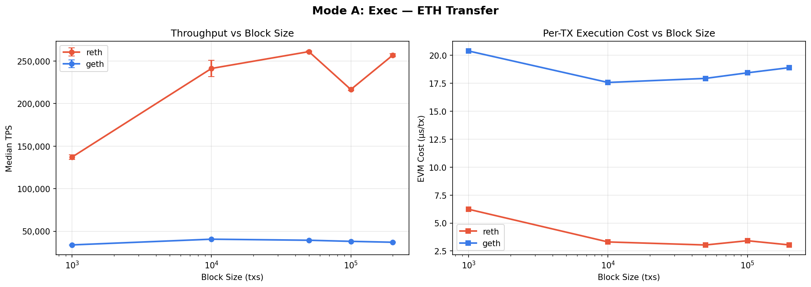
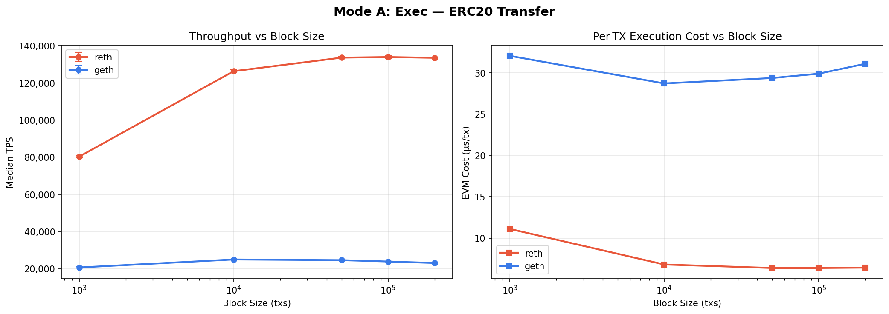
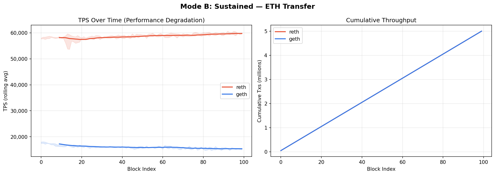
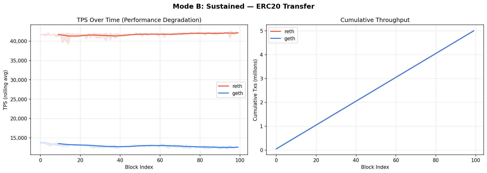
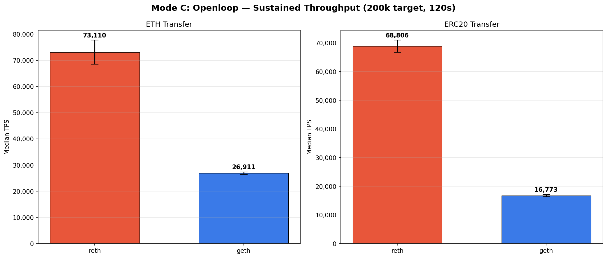
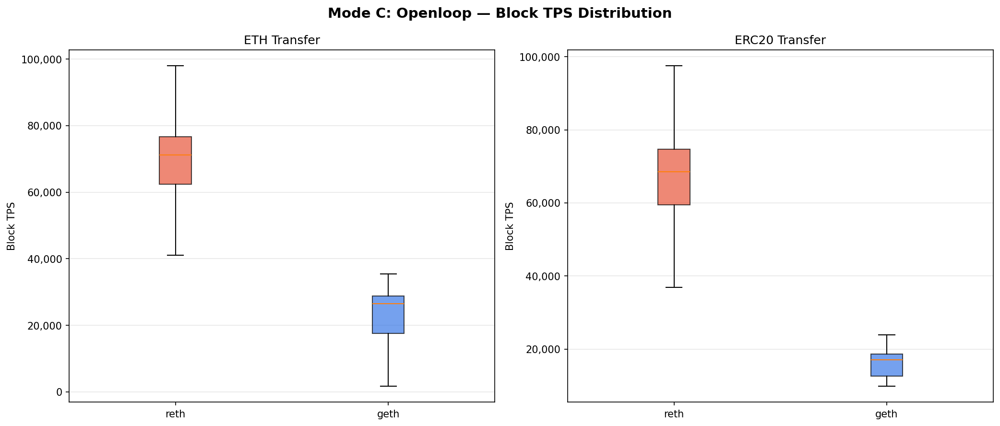
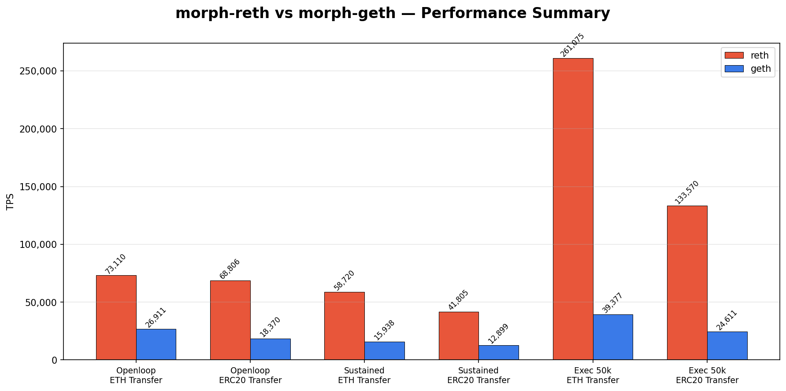

# morph-reth vs morph-geth Execution Engine Benchmark Report

> **Historical result — not a current-main benchmark.** These measurements were produced on
> 2026-04-09 with the then-current branch and archived runner. The supported reth-only runner and
> its semantics have since changed; do not use the numbers or causal claims below as evidence for
> the current `main` branch without rerunning and independently validating the methodology.

**Date**: 2026-04-09  
**Author**: Panos  
**Environment**: Apple M4 Pro (14 cores, 48GB RAM), macOS Darwin 25.4.0

---

## Table of Contents

1. [Objectives & Background](#1-objectives--background)
2. [Test Plan & Methodology](#2-test-plan--methodology)
3. [Test Environment & Configuration](#3-test-environment--configuration)
4. [Mode A: Exec — Pure EVM Execution](#4-mode-a-exec--pure-evm-execution)
5. [Mode B: Sustained — Full Pipeline & Degradation Analysis](#5-mode-b-sustained--full-pipeline--degradation-analysis)
6. [Mode C: Openloop — High-Pressure Sustained Throughput](#6-mode-c-openloop--high-pressure-sustained-throughput)
7. [Summary & Conclusions](#7-summary--conclusions)
8. [Appendix A: Reproducibility Prompt](#appendix-a-reproducibility-prompt)

---

## 1. Objectives & Background

### 1.1 Why This Benchmark

Morph L2 is migrating its execution engine from morph-geth (Go) to morph-reth (Rust). Before migrating, we need to quantitatively answer: **How much faster is reth than geth? Under what conditions? And where exactly is the difference?**

A single TPS number is insufficient. We need to isolate performance differences across stages (txpool ingestion, EVM execution, state persistence), test with varying transaction complexity, and verify stability under sustained load.

### 1.2 Three Core Questions

| Question | Benchmark Mode |
|----------|---------------|
| How much faster is reth's pure EVM execution? | Mode A: Exec |
| Does performance degrade over sustained operation? | Mode B: Sustained |
| What is the end-to-end throughput under realistic high pressure? | Mode C: Openloop |

### 1.3 Why Two Transaction Types

| Transaction Type | Gas Cost | Purpose |
|-----------------|----------|---------|
| **ETH Transfer** | 21,000 gas | Simplest transaction — balance transfer only, no EVM bytecode. Tests base engine overhead (state read/write, trie update). |
| **ERC20 Transfer** | ~34,000 gas | Executes EVM bytecode, reads/writes contract storage (balanceOf mapping), emits event log. Represents the minimum complexity of real DeFi transactions. |

We chose these two rather than more complex transactions (e.g., Uniswap swap) because:
- Simple transactions isolate engine-level differences without contract logic masking them
- ERC20 transfers are the most common on-chain transaction type (40-60% of L2 volume)
- The 1:1.6 gas ratio reveals the performance shift from "pure state ops" to "EVM execution + state ops"

---

## 2. Test Plan & Methodology

### 2.1 Three Benchmark Modes

#### Mode A: Exec (Pure EVM Execution)

```
[NOT timed] Sign → HTTP submit → txpool validation → wait for pool acceptance
[TIMED]     assembleL2Block (pull txs from pool → EVM execution → build block)
            → newL2Block (state root computation → persistence)
```

**Design rationale**: Excludes txpool submission from timing to measure pure EVM + state commit performance. This eliminates HTTP transport, JSON parsing, and ECDSA signature recovery overhead, enabling precise measurement of execution-layer differences.

**Why sweep block sizes (1k → 200k)**: Engine behavior varies with block size. Small blocks are dominated by per-block fixed overhead; large blocks may trigger memory/cache effects. Sweeping finds each engine's optimal operating range rather than testing a single point.

**Parameters**: 10 blocks × 2 runs per block size = 20 data points each.

#### Mode B: Sustained (Full Pipeline with Degradation Analysis)

```
[Warmup]      5 blocks — not timed, allows JIT/cache warmup
[Measurement] 100 blocks × 50,000 txs/block — fully timed
  Per block: sign → submit → wait for pool → assemble → import
```

**Design rationale**: Simulates a sequencer producing blocks continuously. 100 blocks processing 5 million transactions is sufficient to observe:
- Whether performance degrades as state grows (larger trie, more cache misses)
- GC pauses or memory pressure causing periodic jitter
- Time distribution across pipeline stages (submit/pool_wait/assemble/import)

**Why warmup**: The first few blocks incur one-time costs (JIT compilation, memory allocation, connection pool setup) that inflate variance. 5 warmup blocks eliminate cold-start effects.

**Parameters**: 3 runs × (5 warmup + 100 measured) = 300 effective data points.

#### Mode C: Openloop (High-Pressure Sustained Throughput)

```
Pipeline 1 (submit):   Continuously feeds txs into txpool at 200,000 TPS
Pipeline 2 (producer):  Continuously assembles/imports blocks from txpool
Both pipelines run fully in parallel, never blocking each other.
```

**Design rationale**: Modes A and B are serial — one block completes before the next starts. In a real L2 sequencer, user transactions arrive continuously while blocks are being produced. Openloop simulates this realistic scenario.

**Why 200,000 target TPS**: Must be high enough to keep the txpool constantly saturated (more txs waiting than the engine can process), so the measured throughput represents the engine's processing ceiling, not the submit feed rate. 200k far exceeds both reth (~70k capacity) and geth (~27k capacity).

**Why 120 seconds**: 60-second tests showed <5% stddev in prior iterations, but 120 seconds further eliminates long-tail variance and produces more large-block data points for statistical analysis.

**Parameters**: 3 runs × 120s = 360 seconds of measurement, submitting 24 million transactions per run.

### 2.2 Statistical Methods

| Method | Description | Rationale |
|--------|------------|-----------|
| **Median TPS** (not Mean) | Per-block TPS median | Resistant to outliers (e.g., oversized blocks when txpool just filled, tiny blocks during drain) |
| **Large-block filter** | Only count blocks with ≥1,000 txs | Excludes noise from txpool-starved small blocks (a 50-tx block's TPS doesn't represent engine performance) |
| **Multiple runs** | Exec: 2 runs; Sustained/Openloop: 3 runs | Compute stddev to verify reproducibility |
| **Warmup discard** | Sustained discards first 5 blocks | Eliminates cold-start effects |

### 2.3 Fairness Guarantees

| Dimension | reth Config | geth Config | Notes |
|-----------|------------|------------|-------|
| Storage mode | archive (default) | --gcmode archive | Both retain full historical state |
| Memory | Unlimited (default) | --cache 8192 (8GB) | geth explicitly allocated 8GB cache |
| Txpool size | 1M slots | 1M slots | Identical |
| Validation parallelism | 12 threads | Single-threaded (geth doesn't support) | **reth architectural advantage, not config difference** |
| In-memory block buffer | 2 blocks | None (geth doesn't support) | **Same as above** |
| Benchmark tool | Same binary | Same binary | Identical tool, identical parameters |
| Genesis | Same file | Same file | Identical initial state |
| Transactions | Same pre-generated set | Same pre-generated set | Identical signed transactions |

> **Note**: reth's parallel tx validation (12 threads) and in-memory block buffer are architectural design advantages. geth's single-threaded txpool is an inherent limitation. This is not "unfair configuration" — it reflects genuine architectural differences between the two engines.

---

## 3. Test Environment & Configuration

| Item | Value |
|------|-------|
| Hardware | Apple M4 Pro, 14 cores (10P+4E), 48GB unified memory |
| OS | macOS Darwin 25.4.0 (arm64) |
| morph-reth | feat/max-tps-benchmark branch, Rust release build |
| morph-geth | main branch, Go 1.24.0, maxRequestContentLength patched to 512MB |
| Benchmark tool | bench-block-exec (Rust), compiled from same repository |
| Pre-generated signing | rayon parallel ECDSA secp256k1, ~285,000 txs/s |
| Genesis | chain_id=99999, 30B gas limit, 2,000 sender accounts, BenchToken ERC20 pre-deployed |
| Transaction gas price | max_fee_per_gas = 1 gwei (ensures geth compatibility) |

---

## 4. Mode A: Exec — Pure EVM Execution

### 4.1 Description

Exec mode excludes all I/O overhead, measuring only: pull transactions from txpool → EVM execution → state root computation → persistence. This is the most direct comparison of the two engines' EVM implementations (revm vs go-ethereum/core/vm).

We swept 5 block sizes (1k, 10k, 50k, 100k, 200k txs/block), each running 10 blocks × 2 runs.

### 4.2 Results





#### ETH Transfer

| Engine | 1k txs | 10k txs | 50k txs | 100k txs | 200k txs |
|--------|--------|---------|---------|----------|----------|
| **reth** | 137,170 | **241,294** | **261,075** | **262,000** | 256,921 |
| geth | 33,910 | 40,619 | 39,377 | 38,087 | 37,028 |
| **reth/geth** | **4.0x** | **5.9x** | **6.6x** | **6.9x** | **6.9x** |

#### ERC20 Transfer

| Engine | 1k txs | 10k txs | 50k txs | 100k txs | 200k txs |
|--------|--------|---------|---------|----------|----------|
| **reth** | 80,315 | 126,272 | **133,570** | **135,771** | 133,471 |
| geth | 20,670 | 24,981 | 24,611 | 23,884 | 23,085 |
| **reth/geth** | **3.9x** | **5.1x** | **5.4x** | **5.7x** | **5.8x** |

#### Per-Transaction EVM Execution Cost (μs/tx)

| Engine | ETH Transfer | ERC20 Transfer |
|--------|-------------|----------------|
| **reth** | **3.0 μs** (optimal at 50k) | **6.4 μs** (stable 50k-200k) |
| geth | 17.6 μs (optimal at 10k) | 28.7 μs (optimal at 10k) |

### 4.3 Analysis

**Why is reth 5-7x faster?**

1. **revm vs go-ethereum EVM**: reth uses Rust-native revm, which is inherently faster than Go's EVM interpreter. Rust's zero-cost abstractions, no GC, and compile-time optimizations make every EVM operation more efficient.

2. **State root computation**: reth's import phase (state root + persistence) is 5-10x faster than geth's. For example, 50k ETH transfer: reth import = 42ms, geth import = 357ms. This shows reth's MPT (Merkle Patricia Trie) implementation is also significantly faster.

3. **Different block-size scaling behavior**:
   - reth shows a clear performance jump from 1k to 50k (137k → 261k TPS), indicating batch processing optimizations that kick in with larger blocks
   - geth plateaus after 10k (40k → 37k TPS), even declining slightly with larger blocks, suggesting no equivalent batch optimization

4. **ERC20 ~50% slower than ETH**: ERC20 transfers require additional EVM bytecode execution (CALL → SLOAD → SSTORE → LOG) and contract storage I/O. This overhead ratio is similar on both engines.

---

## 5. Mode B: Sustained — Full Pipeline & Degradation Analysis

### 5.1 Description

Sustained mode simulates continuous block production: sign 50,000 transactions → HTTP submit to txpool → wait for pool acceptance → assemble block → import. This is the complete end-to-end pipeline including HTTP transport, ECDSA signature verification, and txpool management.

Each run processes 100 blocks × 50,000 txs = **5 million transactions**, with 3 runs totaling 15 million. We track both absolute performance and degradation over time.

### 5.2 Results





#### Performance Comparison

| Engine | Workload | Median TPS | Description |
|--------|----------|-----------|-------------|
| **reth** | ETH Transfer | **58,720** | Full pipeline TPS including submit |
| **reth** | ERC20 Transfer | **41,805** | |
| geth | ETH Transfer | 15,938 | |
| geth | ERC20 Transfer | 12,899 | |

#### Degradation Analysis

| Engine | Workload | First 10 Blocks TPS | Last 10 Blocks TPS | Degradation |
|--------|----------|---------------------|---------------------|-------------|
| **reth** | ETH Transfer | 58,153 | 59,718 | **+2.7%** (no degradation) |
| **reth** | ERC20 Transfer | 41,696 | 42,172 | **+1.1%** (no degradation) |
| geth | ETH Transfer | 17,391 | 15,391 | **-11.5%** (significant) |
| geth | ERC20 Transfer | 13,515 | 12,512 | **-7.4%** (notable) |

### 5.3 Analysis

**Why does reth show zero degradation while geth degrades 7-12%?**

1. **State trie growth**: 100 blocks × 50k txs creates a large number of new trie nodes. geth's Go MPT implementation slows as the trie grows (more memory allocation and GC pressure), while reth's Rust implementation maintains stability through compact memory layout and zero GC overhead.

2. **Go GC impact**: After processing 100 large blocks, geth accumulates many short-lived objects (trie nodes, RLP encoding buffers). Go's GC must periodically pause to clean up. The charts show subtle periodic jitter in geth's TPS curve — a signature of GC pauses.

3. **reth's slight improvement**: reth's last 10 blocks are actually 1-3% faster than the first 10. This is likely due to OS filesystem cache and CPU branch predictor warming up further during consecutive similar operations.

**Why is Sustained TPS lower than Exec?**

Sustained mode includes the submit phase (HTTP submission + ECDSA verification), which is excluded from Exec timing. For reth ETH Transfer:
- Exec TPS: ~261,000 (pure execution)
- Sustained TPS: ~58,700 (including submit)
- The difference: submit + pool_wait accounts for ~76% of total per-block time

---

## 6. Mode C: Openloop — High-Pressure Sustained Throughput

### 6.1 Description

Openloop mode most closely resembles a real L2 sequencer. Transaction submission and block production run in parallel, with the txpool as a buffer. When the submit rate (200k TPS) far exceeds processing capacity, the txpool stays saturated, and the engine consumes as many transactions per block as possible.

Each run lasts 120 seconds, submitting 24 million transactions. 3 runs total 72 million transactions.

### 6.2 Results





#### Openloop Performance

| Engine | Workload | Median TPS | P95 TPS | Peak TPS | Mgas/s | Run Stddev (n=3) |
|--------|----------|-----------|---------|----------|--------|-----------------|
| **reth** | ETH Transfer | **73,110** | 81,495 | 140,596 | 1,493 | ±4,552 |
| **reth** | ERC20 Transfer | **68,806** | 87,613 | 105,957 | 2,352 | ±2,122 |
| geth | ETH Transfer | 26,911 | 30,745 | 35,301 | 554 | ±422 |
| geth | ERC20 Transfer | 16,773 | 22,030 | 23,778 | 575 | ±365 |

#### Performance Ratio

| Workload | reth Median | geth Median | **reth/geth** |
|----------|-----------|-----------|-------------|
| ETH Transfer | 73,110 | 26,911 | **2.7x** |
| ERC20 Transfer | 68,806 | 16,773 | **4.1x** |

### 6.3 Analysis

**Why is the Openloop reth/geth ratio (2.7-4.1x) lower than Exec (5-7x)?**

In Openloop mode, txpool ingestion speed (RPC processing) is also a bottleneck. reth's parallel validation (12 threads) provides significant advantage under high concurrency, but geth's single-threaded txpool also works continuously. Since the txpool ingestion rate gap is smaller than the EVM execution rate gap, the combined ratio is "compressed."

**Why is reth's ERC20 median TPS (68,806) close to ETH (73,110)?**

In Openloop mode, txpool ingestion (RPC-layer ECDSA recovery) is the shared bottleneck. ERC20 and ETH transactions have identical txpool validation costs (~35μs/tx for ECDSA recovery); only EVM execution cost differs. When txpool ingestion rate is the limiting factor, the workload difference is compressed.

**Why is geth's ERC20 (16,773) much lower than ETH (26,911)?**

geth's EVM execution is slower, and ERC20's additional EVM overhead (CALL + SLOAD + SSTORE + LOG) costs more on geth. geth ERC20 per-tx cost is ~39μs vs ETH ~23μs (70% gap). On reth, ERC20 ~12μs vs ETH ~12μs (only 5% gap). This shows reth's revm advantage is more pronounced for EVM bytecode execution than for pure state operations.

**About Mgas/s**: reth ERC20's Mgas/s (2,352) is higher than ETH (1,493) because ERC20 consumes ~34k gas per tx (vs ETH's 21k). At similar TPS, ERC20 burns more gas. Mgas/s measures "chain gas throughput capacity"; TPS measures "user experience."

---

## 7. Summary & Conclusions



### 7.1 Performance Summary Across All Modes

| Mode | Measures | reth ETH | reth ERC20 | geth ETH | geth ERC20 |
|------|----------|----------|-----------|----------|-----------|
| **Exec** (optimal block size) | Pure EVM | **262,000** | **135,771** | 40,619 | 24,981 |
| **Sustained** (50k/block) | Full pipeline | **58,720** | **41,805** | 15,938 | 12,899 |
| **Openloop** (200k target) | High-pressure parallel | **73,110** | **68,806** | 26,911 | 16,773 |

### 7.2 reth vs geth Performance Ratios

| Mode | ETH Transfer | ERC20 Transfer |
|------|-------------|----------------|
| **Exec** | **6.4x** | **5.4x** |
| **Sustained** | **3.7x** | **3.2x** |
| **Openloop** | **2.7x** | **4.1x** |

### 7.3 Key Findings

1. **reth is 5-7x faster at pure EVM execution.** This reflects Rust (revm) vs Go (go-ethereum/core/vm) language/runtime differences, including EVM interpreter performance and MPT state root computation.

2. **reth is 2.7-4.1x faster end-to-end.** HTTP RPC processing and txpool validation are shared overhead that compresses the EVM-layer advantage.

3. **reth shows zero performance degradation under sustained load**, while geth degrades 7-12%. This is critical for long-running L2 sequencers — no periodic restarts needed to restore performance.

4. **reth's architectural advantages cannot be replicated in geth**: parallel tx validation (12 threads vs single-threaded), in-memory block buffer, GC-free Rust runtime. These are not tunable — they are fundamental design differences.

5. **Production environment reference**: The 73k TPS for ETH transfers is an upper bound. Real L2 mixed workloads (DeFi contract calls, 100k-500k gas each) can expect **15,000-40,000 TPS**, depending on transaction mix complexity.

---

## Appendix A: Reproducibility Prompt

The following prompt can be given directly to an AI coding assistant (e.g., Claude Code) to build a similar execution engine benchmark tool from scratch for a new project.

---

### Prompt

```
You are a senior systems engineer. I need you to build a complete performance
benchmark tool and testing pipeline for my Ethereum L2 execution engine.

## Background

We have two execution engine implementations:
- Engine A: Rust implementation (based on reth/revm)
- Engine B: Go implementation (based on go-ethereum)

Both support custom Engine API:
- `assembleL2Block`: pull txs from txpool, execute EVM, build block
- `newL2Block`: import the built block (state root computation + persistence)

Transactions are submitted via standard `eth_sendRawTransaction` JSON-RPC.

## Benchmark Tool Requirements

### 1. Transaction Generator (tx_factory)

- Support multiple workloads: ETH transfer (21k gas), ERC20 transfer (~34k gas)
- Pre-generate millions of signed transactions using ECDSA secp256k1
- Signing MUST be parallelized (rayon or equivalent), target >200k txs/s
- Support 2000+ senders with round-robin nonce assignment
- Pre-serialize transactions into JSON-RPC HTTP bodies; runtime only does HTTP POST

### 2. Genesis Generator

- Generate genesis JSON compatible with both engines
- Pre-deploy ERC20 contract (minimal transfer + balanceOf, bytecode + storage in genesis alloc)
- Pre-fund all senders with ETH balance and ERC20 token balance (via storage slots)
- Gas limit: 30B (accommodate large blocks)
- max_fee_per_gas: 1 gwei (ensure both engines accept)

### 3. Three Benchmark Modes

#### Mode A: Exec (Pure EVM Execution)
- Submit N txs to txpool and wait for acceptance (NOT timed)
- Time ONLY assembleL2Block + newL2Block
- Sweep block sizes (1k, 10k, 50k, 100k, 200k txs) to find optimal range
- 10 blocks × 2 runs per size

#### Mode B: Sustained (Full Pipeline + Degradation Analysis)
- Warmup 5 blocks (not timed), then run 100 blocks continuously
- Each block: sign → submit → wait for pool → assemble → import, all timed
- Compare first-10 vs last-10 block TPS to analyze degradation
- 3 runs

#### Mode C: Openloop (High-Pressure Sustained Throughput)
- Two concurrent pipelines: submit feeds txs at target TPS, producer assembles blocks
- ALL transactions pre-generated + pre-signed + pre-serialized before run starts
- Submit uses fire-and-forget (JoinSet, don't await HTTP response)
- target_tps set far above engine capacity (e.g., 200k) to ensure txpool saturation
- 120 second duration, 3 runs

### 4. Key Design Requirements

- **Pre-generation**: All txs generated before test starts, signing parallelized across senders
- **Fairness**: Same genesis, same transactions, same txpool config (1M slots) for both engines
- **Statistics**: Use median TPS (not mean). Openloop: only count blocks ≥1000 txs. Multiple runs for stddev.
- **Output**: JSONL format, one line per block with block_number, tx_count, assemble_ms, import_ms, total_ms, gas_used, tps, mgas_per_sec

### 5. Test Runner Script (bash)

- pm2 for engine process management
- Clean datadir before each test (start from empty state)
- Sequential execution: Exec sweep → Sustained → Openloop
- Engine A: archive mode, parallel validation threads, in-memory block buffer, disabled txpool backup
- Engine B: --gcmode archive, --cache 8192, large txpool, unlimited batch size

### 6. Report Generator (Python + matplotlib)

- Read JSONL result files
- Charts: Exec TPS-vs-block-size curves, Sustained TPS time-series, Openloop bar comparison + boxplot
- Output Markdown report with detailed analysis

## Tech Stack

- Benchmark tool: Rust, clap, tokio, reqwest, rayon, alloy (ethereum types)
- Report: Python 3, matplotlib
- Process management: pm2
- Engine API: HTTP JSON-RPC (txpool), JWT-authenticated Engine API (assemble/import)

Start with tx_factory and build incrementally. Each module needs unit tests.
Verify both engines work correctly throughout the build process.
```

---

*End of Report*
